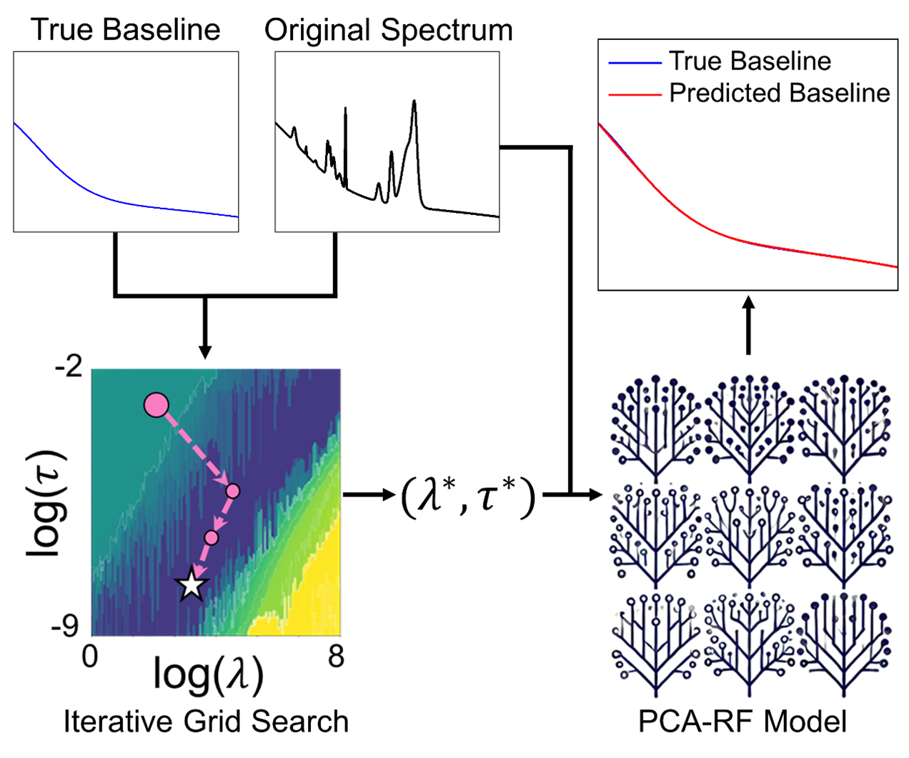

# OP-airPLS

## Overview

This repository is for OP-airPLS, an adaptive grid search optimization algorithm to find the best parameters for the airPLS baseline removal, and its proceeding steps of using a PCA-RF model to predict the best parameters for the airPLS algorithm directly.

It contains sample data used in the experiments, demonstrations of using Jupyter notebook files to run the optimization algorithm, and a Jupyter notebook file to do the prediction given the trained model. 

<!--  -->

## Requirements

The code in this repo has been tested with the following software versions:
- Python 3.11.5
- Numpy 1.24.3
- Pandas 2.2.1
- Matplotlib 3.8.4
- Scipy 1.11.1
- Scikit-Learn 1.4.1

We recommend using the Anaconda Python distribution, which is available for Windows, MacOS, and Linux. Installation for all required packages (listed above) has been tested using the standard instructions from the providers of each package. 

## Data

The sample data for the experiments can be found and downloaded in the `data` subdirectory.

## Running the notebooks

Experiments reported in the notebooks were achieved using 1) a laptop with Windows 11, Intel i7-10875H CPU (2.30GHz) and 32 GB RAM; and 2) a desktop with Windows 11, Intel i7-13700KF CPU (3.40GHz) and 64 GB RAM. If you find any bugs or have questions, please contact `jiaheng.cui@uga.edu` or `zhao-nano-lab@uga.edu`.
